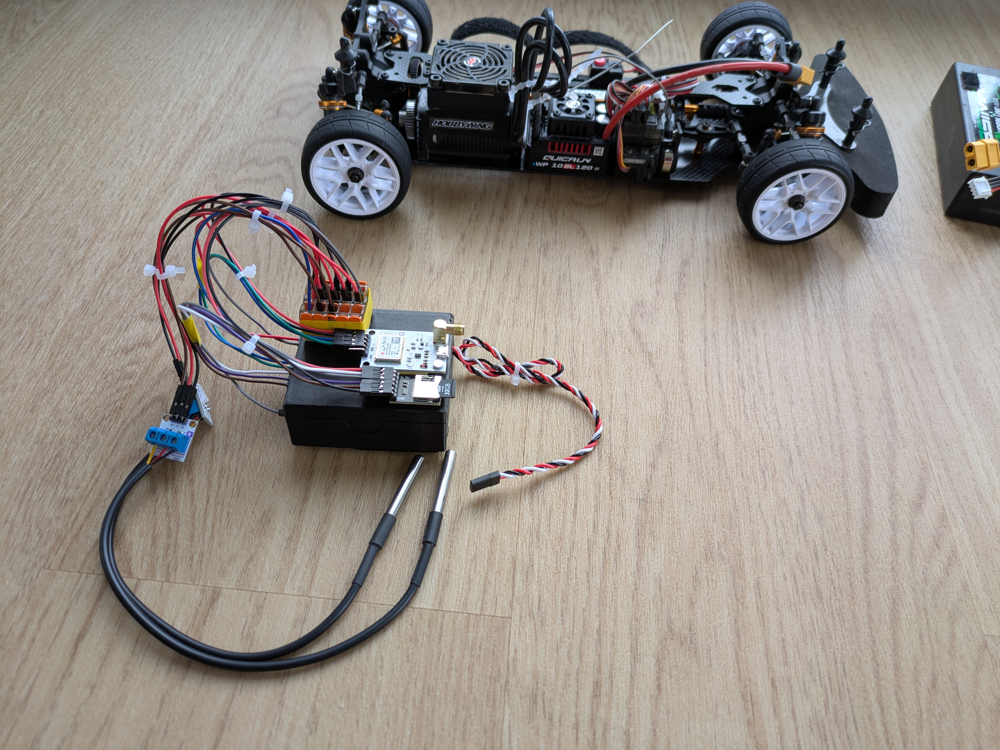
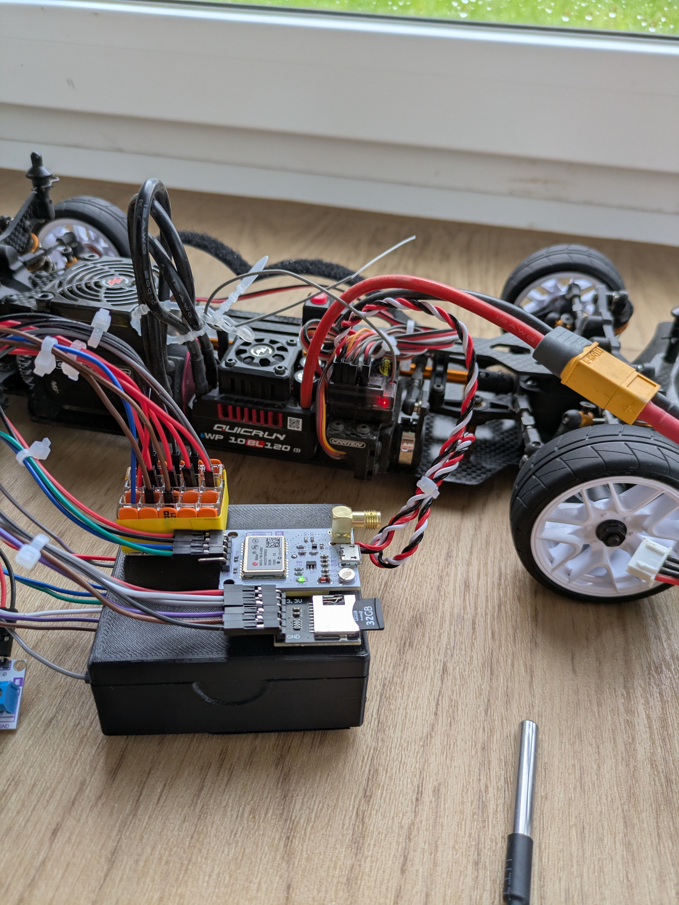

# Carten Telemetry

## Table of Contents
* [1. Project Description and Specifications](#1-project-description-and-specifications)
* [2. Bill of Materials (BOM)](#2-bill-of-materials-bom)
* [3. Schematic and System Architecture](#3-schematic-and-system-architecture)
* [4. Implementation and Setup](#4-implementation-and-setup)
  * [4.1 Software and Firmware Compilation](#41-software-and-firmware-compilation)
  * [4.2 Electrical Wiring](#42-electrical-wiring)
  * [4.3 Mechanical Integration](#43-mechanical-integration)
* [5. Operation Mode and Data Analysis](#5-operation-mode-and-data-analysis)
* [6. CI/CD: Reddit Feedback Synchronization](#6-cicd-reddit-feedback-synchronization)

## 1. Project Description and Specifications

 

Development of a local telemetry system for the RC car Carten T410R . The system records dynamic and thermal parameters during driving operation.

**Recorded Metrics and Specifications:**
* **Temperature:** Recording of motor and ESC temperatures (measuring range -55°C to +125°C, 12-bit resolution) via the 1-Wire bus.
* **RPM:** RPM recording of the driveshaft using a Hall effect sensor and neodymium magnet (hardware-assisted pulse counter).
* **Geodata:** Recording of latitude and longitude as well as absolute speed (GNSS/GPS satellite data via NMEA 0183 protocol, update rate configurable between 1 Hz and 10 Hz).

**Architecture Variant:**
* Exclusive offline logging on a local MicroSD card. To prevent latencies and connection drops, no data transmission occurs over wireless networks.

## 2. Bill of Materials (BOM)
For replication, the following components or equivalent specifications must be used:

| Component | Specification / Type | Function in System |
| :--- | :--- | :--- |
| Microcontroller | ESP32 Dev Board (30-Pin Variant, e.g., NodeMCU) | Central ingestion and processing of sensor data |
| Expansion Board | ESP32 Terminal Breakout Board (30-Pin) | Secure connection of jumper wires without soldering |
| GPS Module | BN-220 (u-blox M8N) | Provision of geodata (Baud rate 9600) |
| Storage Module | MicroSD Card Module (SPI) | Persistent data storage (strictly 3.3V logic) |
| Temperature Sensor | DS18B20 (TO-92 or waterproof) | 2x sensors for temperature monitoring (Motor, ESC) |
| RPM Sensor | Hall Sensor Module (A3144) | Detection of magnetic field changes |
| Magnet | Neodymium Magnet (3x2mm) | Rotating pulse generator on the driveshaft |
| Power Supply | 3-Pin Servo Cable (JR Connector) | 5V voltage tap via the BEC of the RC receiver |

## 3. Schematic and System Architecture
All hardware components share a common ground (GND) to avoid floating potentials. The serial UART connection between the ESP32 and the GPS module requires physical crossing of lines (TX to RX, RX to TX). The peak current demand of the overall system is approximately 200 mA to 250 mA.

| Component | Interface | ESP32 Pin | Sensor Pin | Remark |
| :--- | :--- | :--- | :--- | :--- |
| RC Receiver | Power | `VIN` | 5V (Red) | Parasitic supply via ESC/Receiver (BEC) |
| | | `GND` | GND (Black) | Reference potential |
| GPS Module | UART 2 | `GPIO 16` (RX2) | TX | VCC power supply strictly via 3.3V of the ESP32 |
| | | `GPIO 17` (TX2) | RX | |
| MicroSD Module | SPI | `GPIO 23`, `19`, `18`, `5` | MOSI, MISO, SCK, CS | VCC power supply strictly via 3.3V of the ESP32 |
| DS18B20 | 1-Wire | `GPIO 4` | DQ (Data) | Parallel connection of both sensors |
| A3144 Hall Sensor | Dig. Out | `GPIO 2` | DO (Signal) | Connection to ESP32 PCNT (Pulse Counter) |

*(The detailed visual schematic can be found in the `/schematic` directory.)*

## 4. Implementation and Setup

### 4.1 Software and Firmware Compilation
* **Environment:** Compilation requires PlatformIO or the Arduino IDE.
* **Libraries:** To compile the source code, `TinyGPSPlus`, `OneWire`, and `DallasTemperature` must be installed in the Library Manager.
* **Flashing Process:** The firmware must be uploaded to the ESP32 via the USB interface. In case of boot issues, the serial output (`115200` baud) must be checked for initialization errors (e.g., SD card not found).

### 4.2 Electrical Wiring
* The ESP32 must be plugged onto the terminal breakout board. All jumper wires must be securely fastened in the screw terminals of the breakout board to ensure vibration-resistant connections.
* The servo cable must be screwed with correct polarity via jumper wires to the `VIN` (5V) and `GND` terminals and connected to a free port of the RC receiver.
* The connection of the GPS, SD module, Hall sensor, and temperature sensors must be carried out according to the documented pin assignment using jumper wires and the breakout board terminals.
* For multiple connections (e.g., merging several GND or 3.3V lines of the sensors), WAGO clamps must be used. To prevent loose contacts during vibrations, the correct seating in the clamps must be verified.

### 4.3 Mechanical Integration
* **Central Unit:** The ESP32 enclosure is mounted in the chassis using screwed carrier plates or velcro tape.
* **GPS:** The GPS module must be mounted horizontally. The ceramic antenna must point upwards unobstructed.
* **RPM Measurement:** The neodymium magnet must be fixed adhesively (e.g., superglue or epoxy resin) to the driveshaft. A corresponding counterweight on the opposite side of the shaft prevents imbalances at high rotational speeds. The Hall sensor must be positioned rigidly with a maximum gap of 2 mm above the magnet.
* **Temperatures:** The DS18B20 sensors must be attached to the ESC and motor casing with thermal adhesive.

## 5. Operation Mode and Data Analysis
* **Boot Sequence:** The system starts autonomously when the RC vehicle is turned on. After successful initialization of the SPI bus, the writing process begins.
* **Logging Cycle:** Sensor data is written to the MicroSD card at a frequency of 2 Hz. The 2 Hz limitation prevents write buffer overruns of the SD card.
* **Data Format:** The output is a standardized CSV or JSON file on a FAT32-formatted partition.
* **Post-Processing:** After completing the run, the MicroSD card must be removed manually. The raw data can be visualized and evaluated in spreadsheet programs or analysis scripts.

## 6. CI/CD: Reddit Feedback Synchronization
A configured GitHub Action is used to extract external project feedback from the linked Reddit thread.

### Architecture
* **Python Script (`scripts/fetch_reddit.py`):** Responsible for fetching the Reddit RSS feed and cleaning the HTML comments.
* **Automation (`.github/workflows/reddit-sync.yml`):** The cronjob triggers the pipeline every working day at 08:00 UTC.
* **Output Handling:** Newly captured comments are written to the file `reddit/reddit_feedback.md` and automatically committed to the `main` branch by the action.

### Manual Sync
For immediate data synchronization:
* Open the "Actions" tab in the GitHub repository.
* Select the "Fetch Reddit Feedback" workflow.
* Execute "Run workflow". The Markdown file will then be updated.
