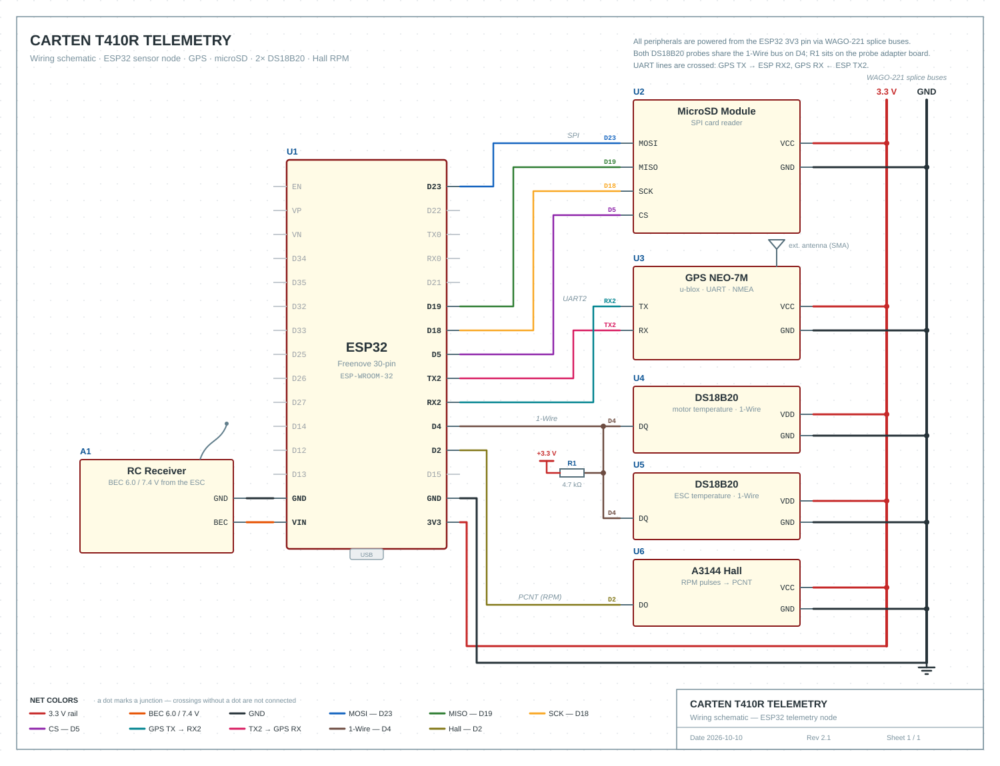

# Pin Mapping and Wiring

## Table of Contents
* [1. Architecture](#1-architecture)
* [2. Schematic](#2-schematic)
* [3. Pin Mapping](#3-pin-mapping)

## 1. Architecture
The architecture is based on an ESP32 as the central processing unit. The data lines are connected via a breakout board with screw terminals.
* GPS Tracking: A GPS module provides geodata and speed values via the NMEA protocol (hardware UART).
* Logging: The MicroSD card serves as primary storage.
* Sensor Reading: Data acquisition is asynchronous. Pulses from the Hall sensor are registered via a hardware counter (PCNT).

## 2. Schematic

## 3. Pin Mapping
All components require a common ground (GND). Serial connections require crossed lines (TX to RX, RX to TX).

| Component | Interface | ESP32 Pin | Sensor Pin | Remark |
| :--- | :--- | :--- | :--- | :--- |
| RC Receiver | Power | `VIN` | 5V (Red) | Supply via ESC/Receiver |
| | | `GND` | GND (Black) | Common ground |
| GPS Module | UART 2 | `GPIO 16` (RX2) | TX | VCC to 3.3V ESP32 |
| | | `GPIO 17` (TX2) | RX | |
| MicroSD Module | SPI | `GPIO 23`, `19`, `18`, `5` | MOSI, MISO, SCK, CS | VCC to 3.3V ESP32 |
| DS18B20 | 1-Wire | `GPIO 4` | DQ (Data) | Parallel connection of both sensors |
| Hall Sensor | Digital In | `GPIO 2` | DO | Connection to ESP32 PCNT (Pulse Counter) |
